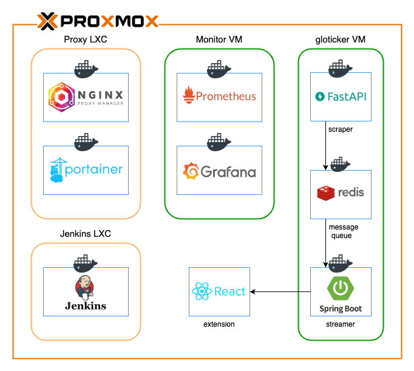

# ticker-stream server

Market data streaming server based on mq

## 📚 Specification

| Endpoint               | Description                | Request Parameters          | Default Values | Range |
| ---------------------- | -------------------------- | --------------------------- | -------------- | ----- |
| `/v1/market/subscribe` | SSE market data stream     | None                        | None           | None  |
| `/v1/market/{type}`    | Get market data by type    | `type`: `snapshot`, `chart` | None           | None  |
| `/v1/market/analysis`  | Get latest market analysis | None                        | None           | None  |

### Response Example

ex) `/v1/market/snapshot`

```json
[
  "AAPL": {
        "current_price": "213.49",
        "market_cap": "3.21 T",
        "change": "3.81",
        "change_percent": "1.82",
        "market_state": "POSTPOST",
        "otc_price": "213.35",
        "otc_change": "-0.14",
        "otc_change_percent": "-0.07"
    }
]
```

## 🛠️ Stack

- Java 17
- Spring Boot
- Redis
- bucket4j
- OpenAI GPT-4
- Proxmox VE
- Docker
- Jenkins
- Nginx
- Prometheus
- Grafana

## 🏗️ Architecture



## 🔄 System Components

### Proxy LXC

- **Nginx Proxy Manager**: Reverse proxy and SSL/TLS termination
- **Portainer**: Container management interface

### Jenkins LXC

- **Jenkins**: CI/CD pipeline

### Monitor VM

- **Prometheus**: Metrics collection and storage
- **Grafana**: Monitoring visualization

### gloticker VM

- **FastAPI**: Market data scraper
- **Redis**: Message queue and cache storage
- **Spring Boot**: Data streaming server
- **React**: Web client extension

## 📈 Data Flow

1. FastAPI scraper collects market data
2. Redis handles message queuing
3. Spring Boot processes real-time data
4. SSE streams to clients

## 📝 License

MIT License
